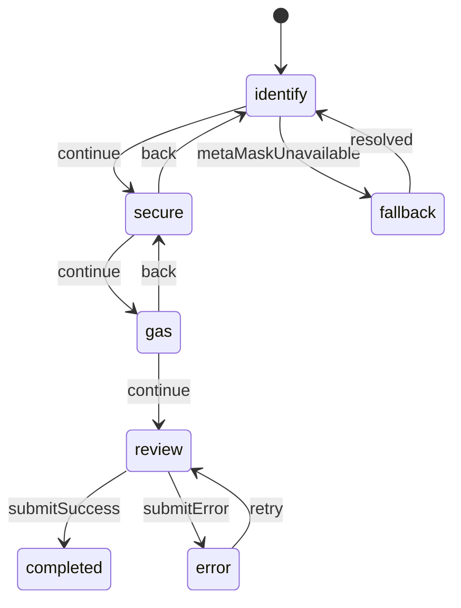

# Smart Account Onboarding Flow

## Goals

- Convert new users into smart-account holders using MetaMask Smart Accounts with the Alchemy Smart Wallet SDK.
- Offer low-friction entry for non-crypto natives (email/social onboarding) while preserving power features (session keys, hardware wallet linking).
- Prepare data and API contracts the backend requires to create intents, register paymasters, and persist recovery settings.

## User Journey

1. **Landing Trigger**
   - CTA from hero (`Get Started`) or dashboard entry point.
   - Detect existing smart account (via profile cache) to skip to completion.
2. **Step 1 · Identify**
   - Options: Sign-in with MetaMask, email magic link, social SSO.
   - SDK handshake initializes embedded AA wallet and returns `aaSessionId`.
3. **Step 2 · Secure**
   - Configure social recovery contacts (2-of-3 default) or hardware backup.
   - Enroll optional passkey for passwordless login.
   - Capture risk flags for compliance (e.g., jurisdiction).
4. **Step 3 · Gas & Funding**
   - Choose sponsorship plan: “Mon-olith covers gas” vs “Bring your own”.
   - Paymaster API estimates sponsorship usage; request signature if BYO.
5. **Step 4 · Review & Create**
   - Display summary (account address, recovery setup, sponsorship).
   - Submit to backend `/aa/onboard` endpoint; backend mints account record and hydrates paymaster.
6. **Completion**
   - Provide quick links to “Bridge USDC -> MON” and “Invite merchant”.
   - Add toast + websocket event for background provisioning updates.

## UI State Machine



## Frontend Components (apps/web)

- `OnboardingFlow` – orchestrates steps, progress state, and mutation handlers.
- `OnboardingStepIdentify` – MetaMask connect button, email/social options.
- `OnboardingStepSecure` – recovery contact form, passkey CTA.
- `OnboardingStepGas` – paymaster selection and cost estimator.
- `OnboardingStepReview` – confirmation summary and submit.
- `useOnboardingStore` – lightweight state container (React hook) storing user selections and API responses.
- `mockOnboardingClient` (temporary) – simulates backend SDK calls until API is live.

## Backend Contracts (planned)

- `POST /api/aa/session` → returns `aaSessionId`, `accountPreview`.
- `POST /api/aa/recovery` → persists recovery contacts (encrypted).
- `POST /api/aa/onboard` → finalizes account, returns `smartAccountAddress`, `paymasterPlanId`.
- `GET /api/aa/status/:sessionId` → onboarding progress for polling.

### Request Payload Draft (`POST /api/aa/onboard`)

```json
{
  "sessionId": "string",
  "accountIntent": {
    "owner": "0x...",
    "loginType": "metamask" | "email" | "social",
    "recovery": {
      "contacts": [
        {"type": "email", "value": "ops@mon-olith.com"}
      ],
      "threshold": 2
    },
    "passkeyEnrolled": true
  },
  "sponsorship": {
    "plan": "starter" | "pro" | "self",
    "acceptedTermsVersion": "2025-11-04"
  }
}
```

## State & Data Requirements

- **Client cache**: persist onboarding progress (localStorage / indexedDB) keyed by `aaSessionId` for resume.
- **Backend DB tables** (to define later):
  - `aa_sessions` – session metadata, status.
  - `aa_recovery_contacts` – encrypted storage for recovery contact info.
  - `aa_sponsorships` – paymaster quotas, renewals.

## Edge Cases

- MetaMask not installed: fallback instructions + link to download; allow email onboarding to continue.
- Session expiry: prompt user to restart or contact support.
- Paymaster quota exceeded: degrade to BYO gas with transparent messaging.
- Compliance hold: surface messaging and route to support if account flagged.

## Next Actions

1. Implement `OnboardingFlow` UI with mocked async calls (current task).
2. Create backend stubs for `aa` endpoints (upcoming task).
3. Integrate real SDK + paymaster once backend events are ready.
4. Define analytics events (`aa_step_complete`, `aa_submit`) for tracking.
